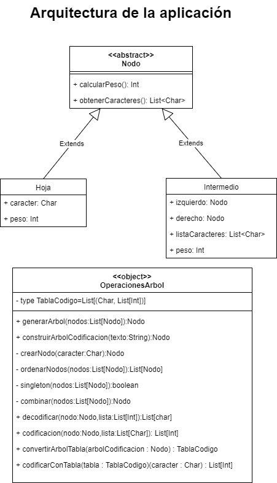

Arquitectura de la aplicación

Introducción

La arquitectura que he elegido ha sido una abstracción de las funcionalidades
que puede tener un nodo de un árbol Huffman en la clase abstracta Nodo, de la
que heredan dos tipos de clases, una Hoja y otra Intermedio, estas
funcionalidades se sobrescriben para cada tipo de nodo. Las clases Hoja e
Intermedio son clases case para poder usar las herramientas que nos proporciona
el lenguaje scala, como el compare, equals, apply y toString.

Una de las funcionalidades que más he usado de las clases case han sido apply,
pues me ha permitido escribir las declaraciones de los objetos como, por
ejemplo: Hoja(‘c’,5) sin necesidad de usar la palabra reservada new.

Otra que también he usado muy a menudo ha sido toString pues me ha permitido ver
directamente el contenido de un nodo en pantalla, e inclusive para utilizarlo
como test para el resultado de construir un árbol de codificación, nada fácil de
testear per se.

Fuera de la arquitectura me ha sido muy útil el utilizar la funcionalidad match
dentro de los métodos, ya que, me ha permitido reducir el código y clarificarlo
más. Esta funcionalidad la he usado concretamente en: codificar y decodificar.

Para que la programación fuese lo más funcional posible he usado métodos como
flatMap que me ha permitido obtener las listas en el formato que necesitaba a la
hora de convertir el árbol a tabla o la codificación rápida.

Diagrama de clases

Figura 1: Diagrama de clases de la aplicación
